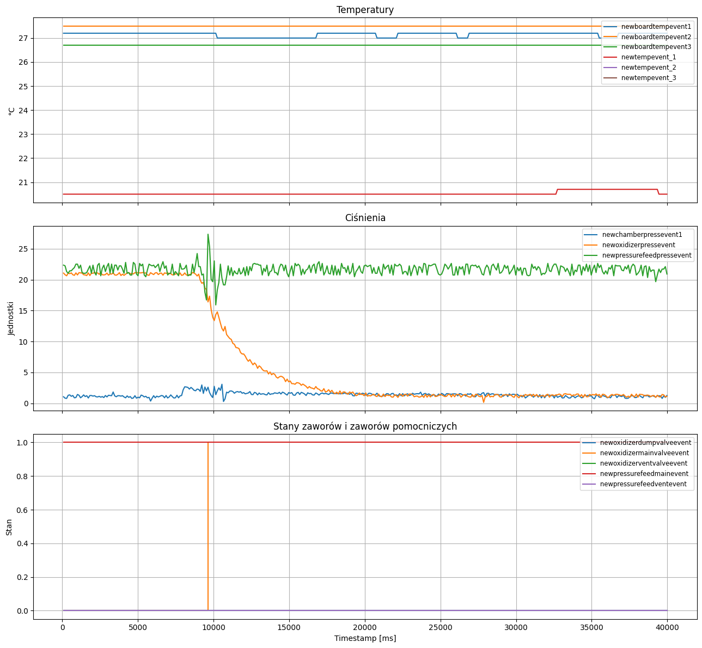

# Cold Flow

Test przepływu układu zasilania **bez zapłonu** — weryfikacja szczelności, ciśnień i sterowania zaworami przed testami z paleniem.

[Nagranie](./cold_flow.mp4)

## Konfiguracja i Wyniki

| Konfiguracja Systemu | Parametry Operacyjne | Wyniki |
| :--- | :--- | :--- |
| **Software:** [v1.1.0](https://github.com/Simba-Avionic/srp/releases/tag/v1.1.0) | **Paliwo:** — | **\\( I_{tot} \\):** — |
| **Hardware:** _do uzupełnienia_ | **Utleniacz:** — | **Max Thrust:** — N |
| **Próbkowanie Tensobelki:** — Hz | **Ciśnienie:** — Bar | **Czas przepływu:** — s |
| **Próbkowanie Ciśnienia:** — Hz | **Temp. Otoczenia:** —°C | |
| | **Odpalenie:** — | |

## Wykresy

| Analiza Ciśnienia | Analiza Ciągu |
|:---:|:---:|
|  |  |

## Post-Mortem
- nie ufamy python`owcom, zawsze trzeba sprawdzic czy pamiętali wszystko dopisać
- Etanol wlewamy na końcu aby umożliwić testy systemu
- Warto by zrobić Launch-box który ułatwił by każdorazowe rozkładanie Avioniki
- cold-flow w liquid na 20Bar nie wyglądają fajnie

## Materiały

| |
|:---:|
| [Nagrania](https://drive.google.com/drive/folders/1QQc-pR0-ygTHSQJzRG7K3Dpg0PRJ70bH) |

Surowe dane: `data/Liquid-Rurku/cold-flow/`
