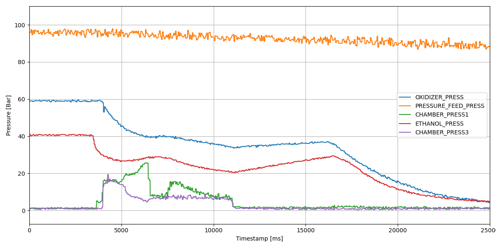

# Static 14.07.2026

## Konfiguracja i Wyniki

| Konfiguracja Systemu | Parametry Operacyjne | Wyniki Silnikowe |
| :--- | :--- | :--- |
| **Software:** [v1.2.0](https://github.com/Simba-Avionic/srp/releases/tag/v1.2.0) |  **Utleniacz:** 7.4kg \\( N_2O \\) ± 200g | **\\( I_{tot} \\):** unknown |
| **Hardware:** [TestBox]() |  |**Burn Time:** 7s |

## Wykresy 

### Log launch1 — interaktywnie

<noscript>Interaktywne dane wymagają JavaScript; obraz archiwalny znajduje się powyżej.</noscript>

### Log launch2 — interaktywnie

<noscript>Interaktywne dane wymagają JavaScript; obraz archiwalny znajduje się powyżej.</noscript>

## Post-Mortem
- Butle z Azotem mają specyficzny gwint
- check valvy nie sprawdzają się wystarczająco dobrze, dalej trzeba blokować przepływ zaworami
- nowe zawory mają tendencję do klinowania się jeśli są zamykane pod dużym ciśnieniem a następnie próbuje się je otworzyć z niskim ciśnieniem
- zapalnik musi być głębiej w komorze
- kamerki trzeba dawac tak jak jest teraz albo blizej
- chyba avionika w końcu musi zrobić swój modół pomiaru tensobelek

## Materiały

| |
|:---:|
[Nagrania](https://drive.google.com/drive/folders/1d65TkSBx83SWk-aAPDYAglD0gByUyFhu)
-----------------------
