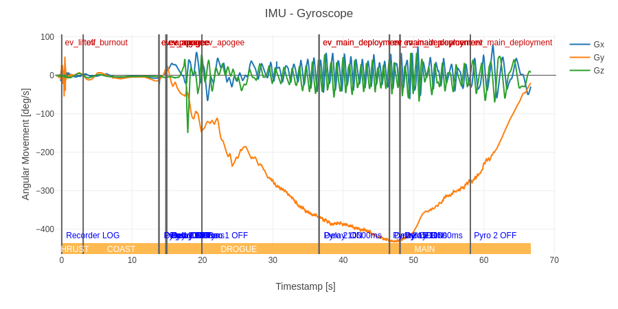
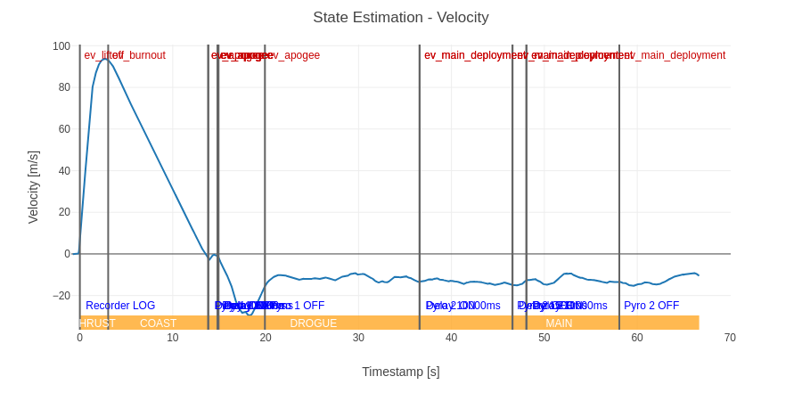
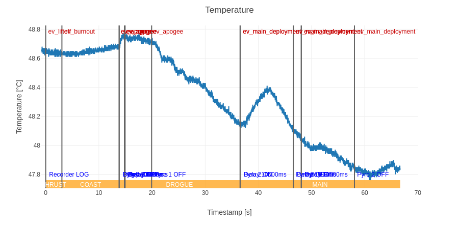

# Launch 31.05.2026

## Konfiguracja i Wyniki

| Konfiguracja Systemu | Parametry Operacyjne | Wyniki |
| :--- | :--- | :--- |
| **Software:** [v0.3.0](https://github.com/Simba-Avionic/srp/releases/tag/v0.1) | **Utleniacz:** XX kg \\( N_2O \\) ± 200 g | **Wysokość lotu:** 709 m |
| **Hardware:** [Engine Board v2](../../common/EngineComputer_schematic.pdf) + [Main Board v2](../../common/FlightComputer_schematic.pdf) | **Ciśnienie:** 47 Bar | **Prędkość maks.:** 93 m/s |
| | | **Przyspieszenie maks.:** 80 m/s² |

## Wykresy 

 

## Post-Mortem
- Trzeba zmierzyć realny czas nagrzewania się podtlenku lud dodać metodę ogrzewania / pressure feed
- Przydała by się awaryjna procedura abortu w razie nieudanego startu

## Materiały

| |
|:---:|
[Nagrania GS]( )
[Nagrania Telefon ]( )
[Dane GS ]( )

-----------------------