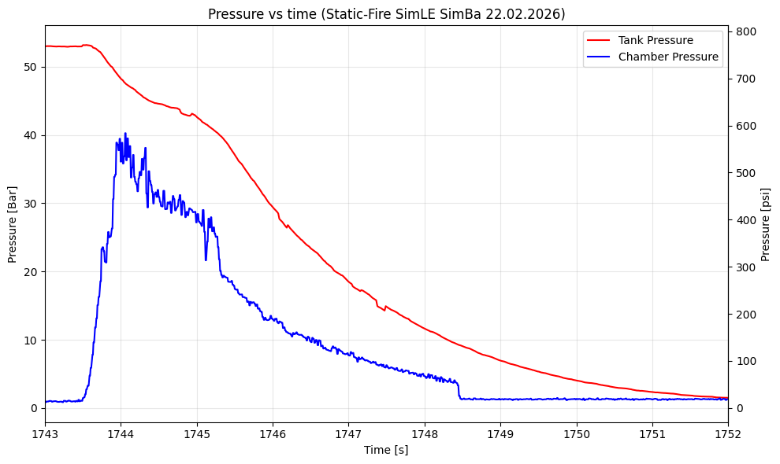
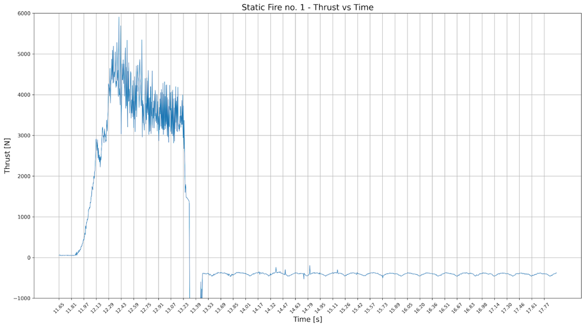

# Static 21.02.2026

## Konfiguracja i Wyniki

| Konfiguracja Systemu | Parametry Operacyjne | Wyniki Silnikowe |
| :--- | :--- | :--- |
| **Soft:** [v0.1.0](https://github.com/Simba-Avionic/srp/releases/tag/v0.1) |  **Utleniacz:** 5.1 kg \\( N_2O \\) ± 200g | **\\( I_{tot} \\):** unknown |
| **Hardware:** DevBoard | **Ciśnienie:** 50 Bar | **Max Thrust:** 5000 N |
| **Próbkowanie Tensobelki:** 320 Hz | **Temp. Otoczenia:** 7°C | **Burn Time:** unknown |
| **Próbkowanie Ciśnienia zbiornika:** 10 Hz | **Próbkowanie Ciśnienia komory:** 10 Hz| **Odpalenie:** srp-app |

## Wykresy 

  

## Post-Mortem
- Trzeba zwiększyć częstotliwość próbkowania ciśnienia aby zobaczyć oscylacje
- Silnik ma nierówne spalanie -> zmniejszenie proporcji paliwa do utleniacza
- Warto by lepiej mocować połączenie tensobelki aby nie stracić danych po 2s
- 2s między zapłonem a otwarciem zaworu to znacząco za dużo -> zmniejszamy do 1.5s

## Materiały

| |
|:---:|
[Nagrania GS](  https://drive.google.com/drive/folders/15RPaZ5ydAYWAkqbo0ocqHZPF6PtVwEi4)
[Nagrania Telefon ](  https://drive.google.com/drive/folders/1-hqclorNGLzYF2rBlWpgVt7yDxVAMdAb)
[Dane GS ](  https://drive.google.com/drive/folders/1qZy7ktI1JaxVaSpvzJJgnKRyEVECuHN2)

-----------------------