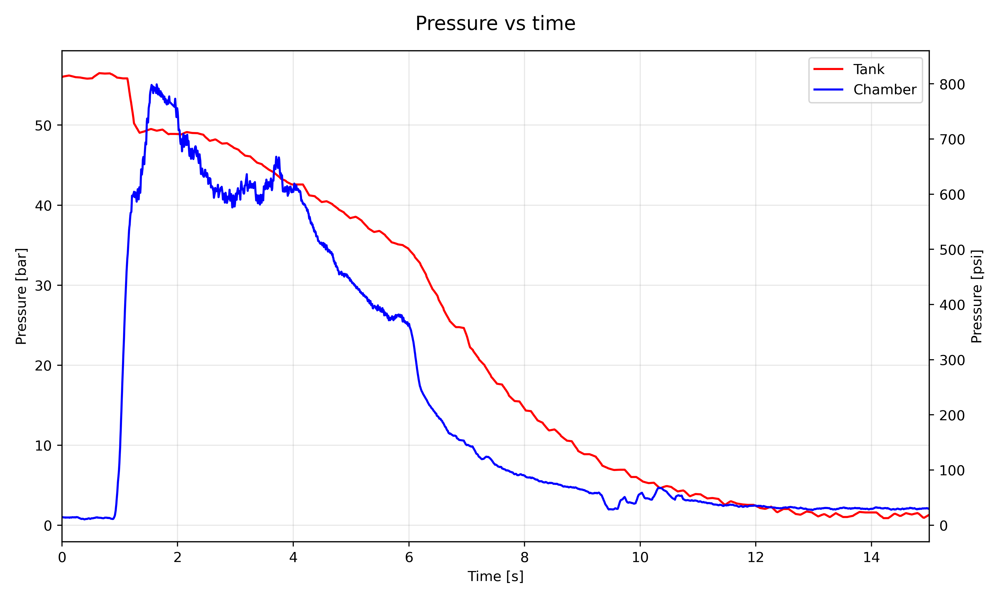
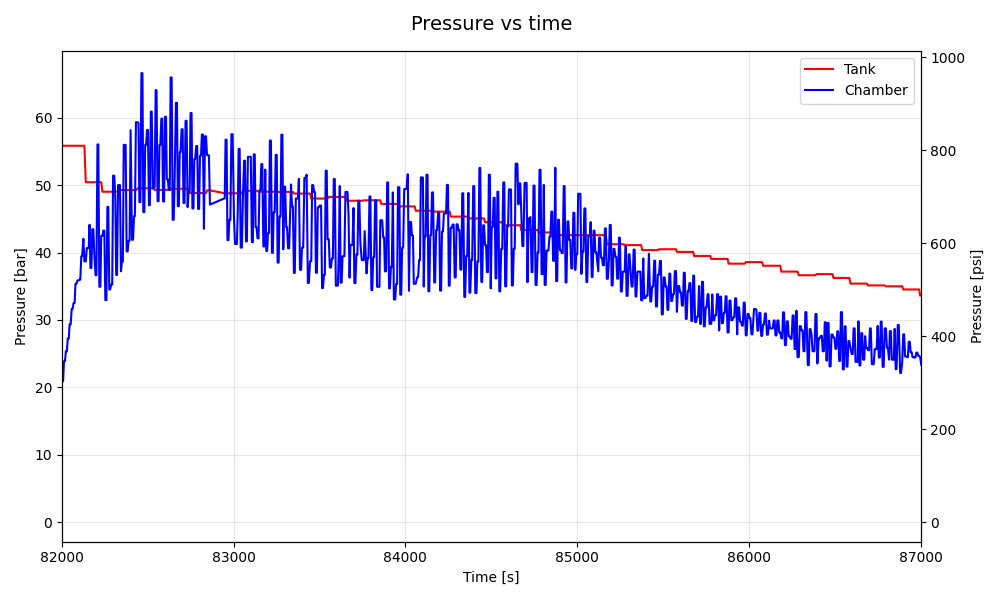
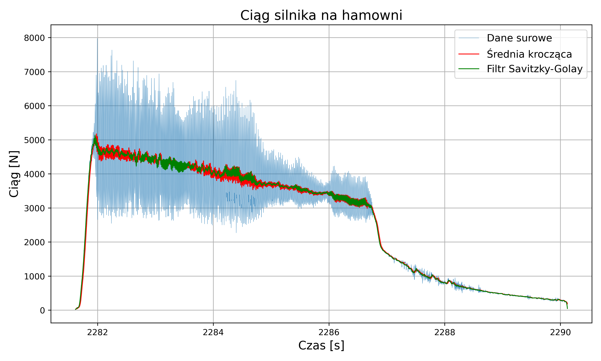

# Static 21.03.2026

## Konfiguracja i Wyniki

| Konfiguracja Systemu | Parametry Operacyjne | Wyniki Silnikowe |
| :--- | :--- | :--- |
| **Soft:** [v0.2.0](https://github.com/Simba-Avionic/srp/releases/tag/v0.2.0) | **Utleniacz:** 9.7kg \\( N_2O \\) ± 200g | **\\( I_{tot} \\):** 22 629.98Ns |
| **Hardware:** Engine Board | **Ciśnienie:** 55 Bar | **Max Thrust:** 5000N |
| **Próbkowanie Tensobelki:** 320Hz | **Temp. Otoczenia:** 12°C | **Burn Time:** 8s |
| **Próbkowanie Ciśnienia zbiornika:** 200Hz | **Odpalenie:** GS Control Panel |  |
| **Próbkowanie Ciśnienia komory:** 200Hz | | |

## Wykresy 

### Wykres cisnienia Zbiornika i Komory

### Przybliżenie na oscylacje Ciśnienia Zbiornika i Komory

### Wykres ciągu

## Post-Mortem
- Posiadanie na test 1 szt elektroniki to znacznie za mało
- Trzeba przygotowywać timeline operacji i lepiej dbać o komunikacje
- Silnik dalej ma problemy ze spalaniem
- Warto używać tych samych definicji mavlink na wszystkich urządzeniach
- Zapraszamy znacznie mniej osób na testy
- 1.5s między zapłonem a otwarciem zaworu to znacząco za dużo -> zmniejszamy do 1s

## Materiały
|  |
|:---:|
| [Nagrania GS ](https://drive.google.com/drive/folders/1AGRGQf30OjB5krCccZ41o4zvRlFLRCa3)
| [Zdjęcia ](https://drive.google.com/drive/folders/1ha7BySZP3P9nL3pT8ho_HKYNsEz_x-fi?usp=sharing)
| [Dane GS ]( https://drive.google.com/drive/folders/17EoyJrxY-R3s7VpP74ydGx4Yyb9mqma4)
