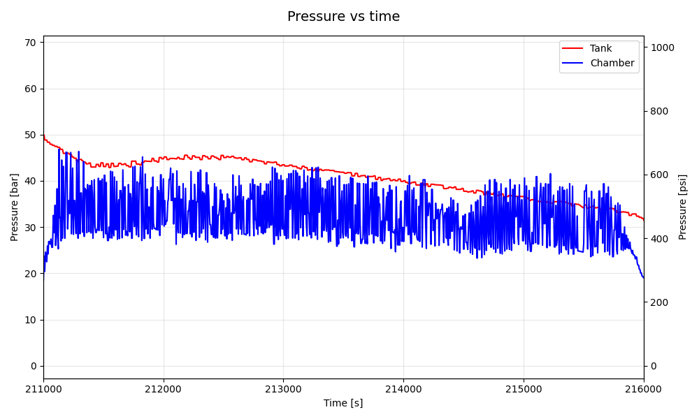

# Static 10.04.2026

## Konfiguracja i Wyniki
| Konfiguracja Systemu | Parametry Operacyjne | Wyniki Silnikowe |
| :--- | :--- | :--- |
| **Soft:** [v0.3.0](https://github.com/Simba-Avionic/srp/releases/tag/v0.3.0) | **Utleniacz:** 8.0 kg \\( N_2O \\) ± 200g | **\\( I_{tot} \\):** 20634.6 Ns |
| **Hardware:** Engine Board + Main Board | **Ciśnienie:** 52 Bar | **Max Thrust:** 4750.7 N |
| **Próbkowanie Tensobelki:** 320 Hz | **Temp. Otoczenia:** 10°C | **Burn Time:** 10 s |
| **Próbkowanie Ciśnienia zbiornika:** 50 Hz | **Próbkowanie Ciśnienia komory:** 166 Hz  | **Odpalenie:** GS Control Panel |

## Wykresy 

### Wykres cisnienia Zbiornika i Komory

### Przybliżenie na oscylacje Ciśnienia Zbiornika i Komory

### Wykres ciągu

## Post-Mortem
- 1s między zapłonem a otwarciem venta to wystarczający czas
- 15 osób do składania rakiety to dalej ciut za dużo
- Modularność SRP jest lepsza niż myślałem
- Warto by było wyeliminować opuźnienia sterowania z GS
- Dlaczego dalej niektóre działy które nie musiały kończyć czegoś na miejscu zdecydowały że to dobry pomysł?
- Warto by dodać funkcję impulsowego otwierania zaworu vent (100ms otwarty 100ms zamknięty)
- Static Fire po zmroku wygląda fajniej na nagraniach
- Przy dużej liczbie gapiów może warto by było mieć 2-3 pachołki i taśmę aby wyznaczyć strefe dla obserwatorów

## Materiały

|  |
|:---:|
| [Zdjęcia & Nagrania](https://drive.google.com/drive/folders/1318bVYpF_e5ZVnfPuNZcweQkrWOe7sXs)
| [Dane GS]( https://drive.google.com/drive/folders/1lCE797Zv3mZs0NX4CaekcU8_AeBpV8zL)

