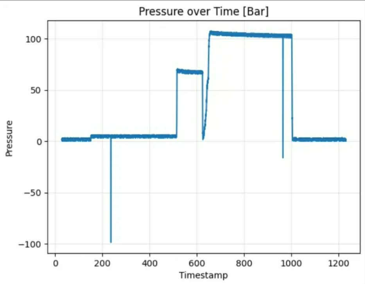

# Test Hydrostatyczny 12.12.2025

## Wyniki
| Test | Ciśnienie  | Czas|
| :--- | :--- | :--- |
| Zbiornik | 105 Bar | 5 min |
| Komora | 60 Bar | 5 min|

## Wykresy

Dostępny jest tylko obraz archiwalny — w repo nie ma źródłowych próbek tego pomiaru.

## Post-Mortem
- To że wskazania z czujników zgadzają się dla 1 Bar nie znaczy że czujnik działa
- Kabelki lutowane na kolanie lubią przerywać i szumić choć i tak nie jest źle
