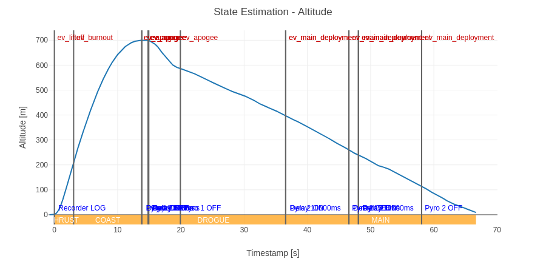
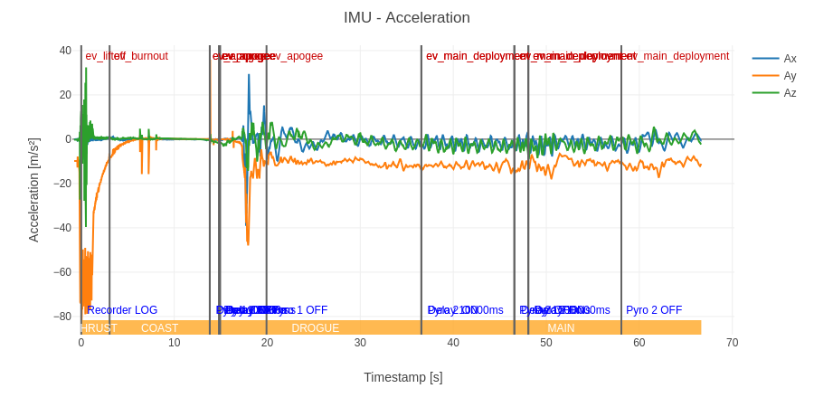

# Launch 31.05.2025

## Konfiguracja i Wyniki

| Konfiguracja Systemu | Parametry Operacyjne | Wyniki |
| :--- | :--- | :--- |
| **Software:** [v1.0.0](https://github.com/Simba-Avionic/srp/releases/tag/v1.0.0) | **Utleniacz:** 5 kg \\( N_2O \\) ± 200 g | **Wysokość lotu:** 709 m |
| **Hardware:** [Engine Board v2](../../../common/EngineComputer_schematic.pdf) + [Main Board v2](../../../common/FlightComputer_schematic.pdf) | **Ciśnienie:** 47 Bar | **Prędkość maks.:** 93 m/s |
| | | **Przyspieszenie maks.:** 80 m/s² |

## Wykresy 

## Post-Mortem
- Trzeba zmierzyć realny czas nagrzewania się podtlenku i dodać metodę ogrzewania / pressure feed
- Przydałaby się awaryjna procedura abortu w razie nieudanego startu
- Mimo 40 stopni i pełnego słońca, zbiornik potrafi się ogrzewać bardzo długo
- Miejscówka FAR-OUT ma bunkry z dużym kawałkiem blachy na dachu, może warto by je wykorzystać i zamiast Yagi którą trzeba celowac wykorzystać zwykłą antenę samochodową (dach wydaje sie wystarczającą przeciwwagą) ?
- 

## Materiały

| |
|:---:|
| [Start Rakiety](./startrakiety.mp4) |
| [Nagrania z Ziemi]() |

-----------------------
