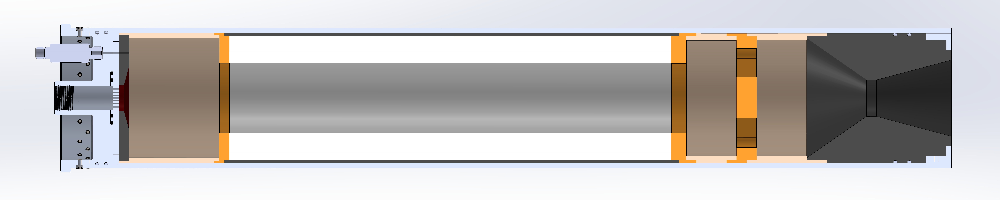
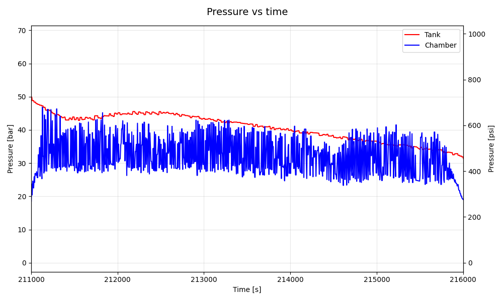
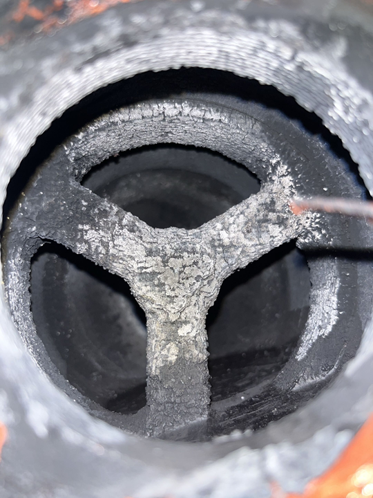

# Static 10.04.2026

## Konfiguracja i Wyniki
| Konfiguracja Systemu | Parametry Operacyjne | Wyniki Silnikowe |
| :--- | :--- | :--- |
| **Software:** [v0.3.0](https://github.com/Simba-Avionic/srp/releases/tag/v0.3.0) | **Utleniacz:** 8.0kg \\( N_2O \\) ± 200g | **\\( I_{tot} \\):** 20634.6Ns |
| **Hardware:** [Engine Computer](../../../common/EngineComputer_schematic.pdf) + [Flight Computer](../../../common/FlightComputer_schematic.pdf) | **Ciśnienie:** 52Bar | **Max Thrust:** 4750.7N |
| **Próbkowanie Tensobelki:** 320Hz | **Temp. Otoczenia:** 10°C | **Burn Time:** 10s |
| **Próbkowanie Ciśnienia zbiornika:** 50Hz | **Odpalenie:** GS Control Panel  | |
| **Próbkowanie Ciśnienia komory:** 166Hz | **Paliwo:** 84% parafina, 15% hotglue, 1% sadza | |

### Wewnętrzny układ komory spalania

## Wykresy 

### Wykres cisnienia Zbiornika i Komory

### Przybliżenie na oscylacje Ciśnienia Zbiornika i Komory

### Wykres ciągu

## Post-Mortem

### Komora spalania

#### Jak wyglądała komora po teście
Izolacja ziarna pękła w trakcie spalania, jednak nie doprowadziło to do przegrzania aluminium, ponieważ parafina również tworzy dobrą warstwę izolacyjną. Powodem była obróbka izolacji ziarna ręcznymi elektronarzędziami na ostatni moment przy pasowaniu ziarna, powinno to się od razu robić na tokarce.  
Mixer nie wyłamał się w trakcie spalania.

#### Jak działał silnik
Silnik miał lepsze spalanie od 2. testu, jego działanie nadal jest niestabilne. Głównym powodem niestabilności silnika prawdopodbnie jest zbyt małej różnicy ciśnień pomiędzy komorą spalania i zbiornika z utleniaczem.

#### Pomysły, co można zmienić
Aby poprawić problem małej różnicy ciśnień można powiększyć średnicę gardła dyszy, co powinno również skutkować powiększonym ciągiem.  
Aby poprawić spalanie można również jeszcze bardziej skrócić ziarno, gdyż nadal wskazuje na lekko za duży udział paliwa.

### Reszta wniosków
- 1s między zapłonem a otwarciem venta to wystarczający czas
- 15 osób do składania rakiety to dalej ciut za dużo
- Modularność SRP jest lepsza niż myślałem
- Warto by było wyeliminować opóźnienia sterowania z GS
- Dlaczego dalej niektóre działy, które nie musiały kończyć czegoś na miejscu, zdecydowały, że to dobry pomysł?
- Warto by dodać funkcję impulsowego otwierania zaworu vent (100ms otwarty 100ms zamknięty)
- Static Fire po zmroku wygląda fajniej na nagraniach, ale należy pamiętać o ustawieniu dobrego ISO
- Przy dużej liczbie gapiów może warto by było mieć 2-3 pachołki i taśmę aby wyznaczyć strefe dla obserwatorów

## Materiały

|  |
|:---:|
| [Zdjęcia & Nagrania](https://drive.google.com/drive/folders/1318bVYpF_e5ZVnfPuNZcweQkrWOe7sXs)
| [Dane GS]( https://drive.google.com/drive/folders/1lCE797Zv3mZs0NX4CaekcU8_AeBpV8zL)

